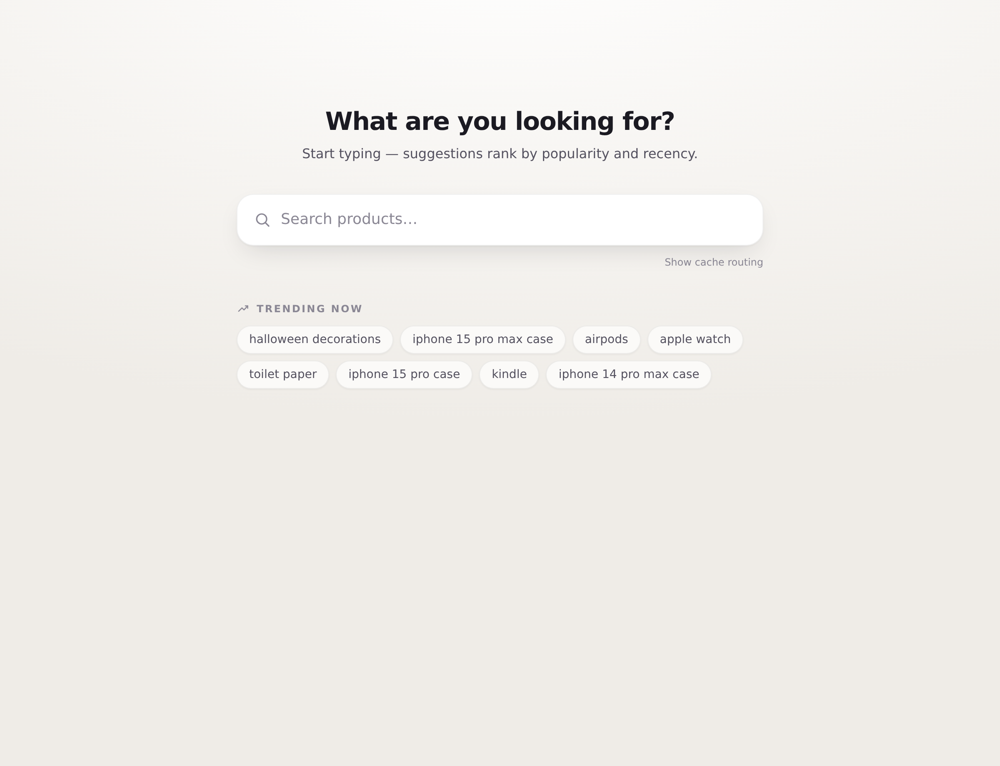
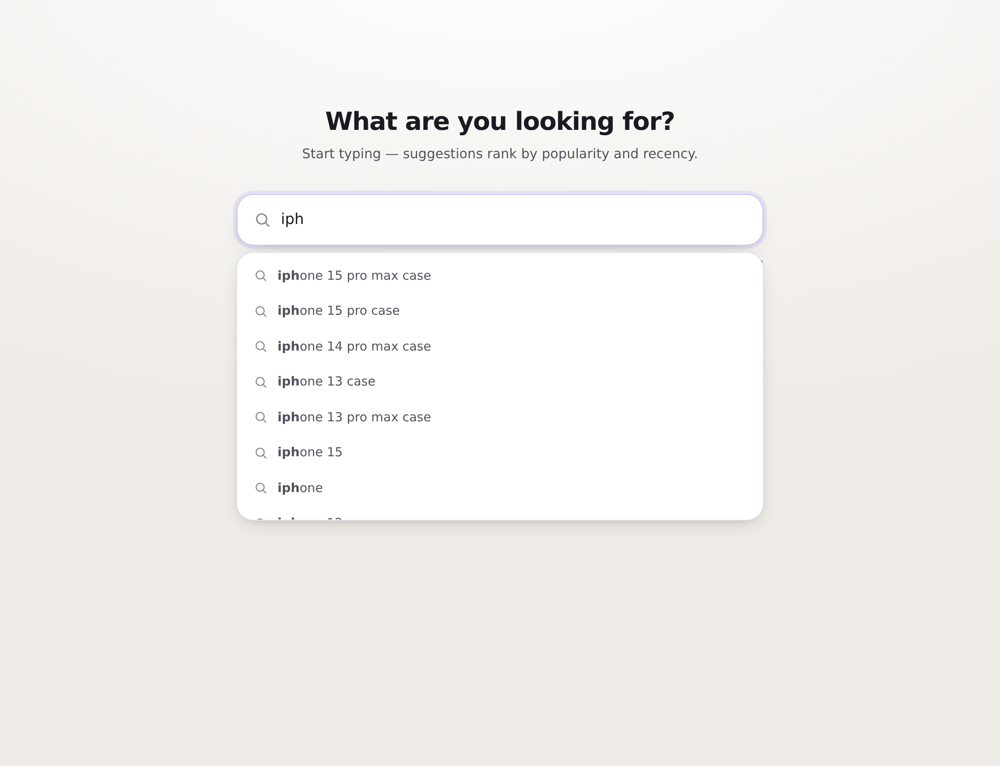
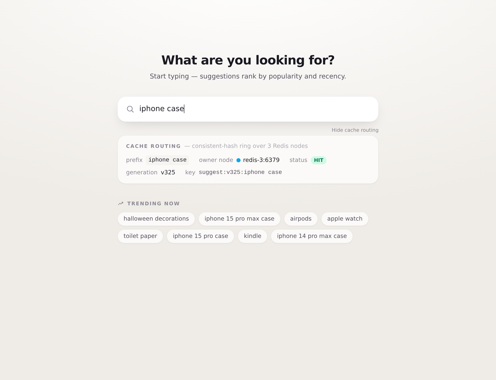

# Search Typeahead

Low-latency search autocomplete: prefix suggestions ranked by **popularity and recency**, with
every submitted search recorded so rankings stay current. Two Spring Boot (Java 21) services
behind nginx, a 3-node Redis cache addressed by a consistent-hash ring, Kafka (KRaft) as a
durable write-ahead log, PostgreSQL as the source of truth, and a React + Vite frontend.

```
type "iph"  ─▶  iphone 15 pro max case
                iphone 15 pro case
                iphone 13 case
                …                         (≤ 10, ranked, < 25 ms p95, 99.8% cache hit)
```

- **Read/write split** — suggestions are served from an in-memory ranked **trie**; a cache miss
  falls back to the trie, never the database.
- **Distributed cache** — three standalone Redis nodes, sharded by a consistent-hash ring the
  service owns (not Redis Cluster); fail-open.
- **Batched writes** — searches flow through Kafka into a batch worker that collapses duplicates
  and writes in one transaction per flush (~15:1 event-to-row reduction under load).
- **Recency-aware trending** — exponentially-decayed recent score blended into ranking
  (see [Recency & trending](#recency--trending)).
- **Stampede defenses** — single-flight + TTL jitter + generation-versioned cache keys.

> **Full write-up:** [`REPORT.md`](./docs/REPORT.md) — architecture diagram, dataset, API docs,
> design trade-offs, and the performance report. Design docs: [`ARCHITECTURE.md`](./docs/ARCHITECTURE.md)
> and [`STACK.md`](./docs/STACK.md).

---

## Screenshots

**Home** — search box with the recency-blended trending section:



**Typeahead** — debounced suggestions, ranked, with the typed prefix in bold and full keyboard navigation:



**Cache routing** — the **Show cache routing** toggle surfaces `GET /api/cache/debug` live: which Redis node owns the prefix (consistent hashing) and whether it's a HIT or MISS:



---

## Architecture at a glance

```
Browser (React/Vite)
      │ /api/*
   nginx :8080  ── static build + path-routed reverse proxy
      ├── /api/suggest, /api/trending ─▶ Suggestion service :8081 ─┬─ consistent-hash ring ─▶ Redis ×3
      │                                                            └─ miss ─▶ in-memory trie ◀── index-builder
      └── /api/search ─────────────────▶ Ingestion service :8082 ── emit ─▶ Kafka ─▶ batch worker ─▶ PostgreSQL
                                                                                                        ▲
                                                              index-builder reads Postgres at build ───┘
```

A rendered diagram and a component-by-component explanation are in [`REPORT.md`](./docs/REPORT.md#1-architecture).

---

## Tech stack

| Layer | Choice |
| ----- | ------ |
| Backend | Java 21 (virtual threads) · Spring Boot 3.3 · Gradle |
| Source of truth | PostgreSQL 16 (Flyway migrations) |
| Cache | Redis 7 ×3 (standalone, consistent-hash ring via Lettuce) |
| Event log | Apache Kafka 3.9 (KRaft mode — no Zookeeper) |
| Edge | nginx (static build + `/api/*` proxy) |
| Frontend | React 18 · Vite 5 · TypeScript · Tailwind |
| Metrics | Spring Actuator + Micrometer (Prometheus) |
| Data loading | DuckDB (Parquet → CSV) |
| Load testing | k6 |
| Orchestration | Docker + Docker Compose |

---

## Prerequisites

- **Docker + Docker Compose** — the only hard requirement; the services build via multi-stage
  Dockerfiles and Gradle runs in a container, so **no local JDK is needed**.
- **Python 3 + `duckdb` + `huggingface-cli`** — only for the one-time dataset load
  (`pip install duckdb huggingface_hub`).
- **Node 20+** — only if you want to run the frontend dev server (`npm run dev`) outside Docker.

---

## Setup / Quick start

```bash
# 1. Bring up the whole stack (Postgres, Redis ×3, Kafka, both services, nginx)
docker compose up -d

# 2. Load the dataset (one-time). Download ≥1 AmazonQAC train shard into ./data first:
huggingface-cli download amazon/AmazonQAC --repo-type dataset \
  --include 'train-*.parquet' --local-dir ./data
./loader/load.sh        # Flyway migrate → DuckDB aggregate → COPY into Postgres

# 3. Open the app
#    http://localhost:8080
```

The suggestion service builds its trie from Postgres on startup and rebuilds every 15 s (demo
cadence), so suggestions appear once the load completes and the next rebuild runs.

**Smoke check:**

```bash
curl "http://localhost:8080/api/suggest?q=iph"     # ranked suggestions
curl "http://localhost:8080/api/trending"          # recency-blended top-10
curl -XPOST "http://localhost:8080/api/search" \
  -H "Content-Type: application/json" -d '{"query":"airpods"}'   # {"message":"Searched"}
```

Dataset loading details, tunables (`TOP_N`, `PARQUET_GLOB`), and verification queries are in
[`REPORT.md` §2](./docs/REPORT.md#2-dataset--source--loading).

---

## Project structure

```
typeahead/
├── docker-compose.yml          # postgres, redis ×3, kafka, services, web (nginx)
├── suggestion-service/         # READ path — trie, ring, cache, index-builder
├── ingestion-service/          # WRITE path — /search, Kafka producer, batch worker
├── shared/                     # SearchEvent, Suggestion value types
├── db/migration/               # Flyway — V1__queries.sql
├── loader/                     # AmazonQAC → Postgres (DuckDB: aggregate.py, load.sh)
├── frontend/                   # React + Vite + TS + Tailwind SPA
├── nginx/                      # nginx.conf (single origin: static + /api proxy)
└── load-test/                  # k6 scenario + Zipfian prefix list + results
```

---

## Ports & configuration

| Service | Host port | Notes |
| ------- | --------- | ----- |
| **web (nginx)** | **8080** | the app + `/api/*` proxy — start here |
| suggestion-service | 8081 | read path |
| ingestion-service | 8082 | write path |
| postgres | 5432 | `app` / `app` / db `typeahead` |
| redis-1/2/3 | 16379 / 16380 / 16381 | cache ring (container port stays 6379) |
| kafka | 9094 | external listener (topic `search-events`) |

Key tunables (in each service's `application.yml`, overridable via env):

| Setting | Default | Effect |
| ------- | ------- | ------ |
| `app.index.max-queries` | 300,000 | trie size vs memory / build time |
| `app.builder.rebuild-interval-ms` | 45,000 (15,000 in compose) | freshness vs build cost |
| `app.cache.base-ttl-seconds` / `jitter-seconds` | 60 / 15 | miss-rate smoothing |
| `app.ring.vnodes` | 150 | cache key-distribution evenness |
| `app.batch.flush-size` / `flush-interval-ms` | 1000 / 5000 | write batching vs staleness |
| `app.decay.half-life-seconds` | 21,600 (6 h) | how fast recency fades |
| `app.index.weights.all-time` / `recent` | 1.0 / 1.0 | popularity vs recency balance |

---

## Recency & trending

**Yes — ranking is recency-aware, end to end.** It is not just all-time popularity. Here is the
full chain, all implemented:

1. **`recent_score` column** on the `queries` table (alongside `all_time_count`).
2. **Lazy exponential decay** applied on every batch write (`ingestion-service`, `UpsertDao`):
   ```sql
   recent_score = queries.recent_score * pow(:factor, extract(epoch FROM now() - last_updated))
                + EXCLUDED.recent_score
   ```
   `:factor = 0.5^(1/half_life)` with a **6-hour half-life** (`app.decay.half-life-seconds`), so a
   query idle for one half-life has its recent score halved before the new delta is added. Decay
   is *lazy* — applied only when a row is touched, no global sweep. This is what stops a brief
   spike from ranking forever.
3. **Blended score baked into the trie** at build time (`suggestion-service`, `Scoring`):
   ```
   score = w1 · log1p(all_time_count) + w2 · recent_score        (w1, w2 default 1.0)
   ```
   `log1p` compresses the popularity tail so one runaway term can't dominate every prefix; the
   `recent_score` term lifts currently-trending queries.
4. **`GET /api/trending`** surfaces the global recency-blended top-10 (the trie root's `topK`).

A fresh load starts every `recent_score` at 0, so trending equals all-time popularity until live
`/api/search` traffic accrues recency — then it shifts toward what's being searched *now*. You can
tune the balance with `app.index.weights.recent` (raise it to make trending more recency-driven).

> **Scope note (honest):** the one optional refinement *not* implemented is read-time
> "decay-to-`now()`" in the index-builder — a row's `recent_score` reflects decay only as of its
> last write, not the exact build instant. The effect is negligible for typeahead and keeps the
> write path the sole writer of the column.

---

## API reference

| Method | Endpoint | Purpose |
| ------ | -------- | ------- |
| `GET` | `/api/suggest?q=<prefix>` | ≤10 ranked prefix matches. `X-Cache: HIT\|MISS\|BYPASS` header. Blank → `[]`. |
| `GET` | `/api/trending` | Global recency-blended top-10. |
| `GET` | `/api/cache/debug?prefix=<p>` | Owning Redis node + hit/miss for a prefix. |
| `POST` | `/api/search` | Body `{"query":"…"}` → `{"message":"Searched"}`; enqueues for batched counting. |
| `GET` | `/actuator/prometheus` | Micrometer metrics (per :8081 / :8082). |

Full request/response shapes and examples: [`REPORT.md` §3](./docs/REPORT.md#3-api-documentation).

---

## Running tests

Unit tests run via the Dockerized Gradle image (no local JDK required):

```bash
docker run --rm -v "$PWD:/work" -v typeahead-gradle-cache:/home/gradle/.gradle \
  -w /work gradle:8.10.2-jdk21 gradle test
```

Covers ring distribution/remap, the trie top-10 merge, and single-flight collapse.

## Load testing

With the stack up and data loaded:

```bash
docker run --rm --network typeahead_default -v "$PWD/load-test:/scripts" \
  -e BASE_URL=http://web:80 grafana/k6 run /scripts/suggest.js
```

Drives a Zipfian-skewed prefix mix + `/search` writes; reports cache hit rate and latency split
by hit/miss. Captured results: [`load-test/RESULTS.md`](./load-test/RESULTS.md).

---

## Documentation

| Doc | Contents |
| --- | -------- |
| [`REPORT.md`](./docs/REPORT.md) | Consolidated report: architecture diagram, dataset, API, trade-offs, performance |
| [`ARCHITECTURE.md`](./docs/ARCHITECTURE.md) | System design — the *what* and *why* |
| [`STACK.md`](./docs/STACK.md) | Technology choices and rationale |
| [`load-test/RESULTS.md`](./load-test/RESULTS.md) | Measured performance numbers |
