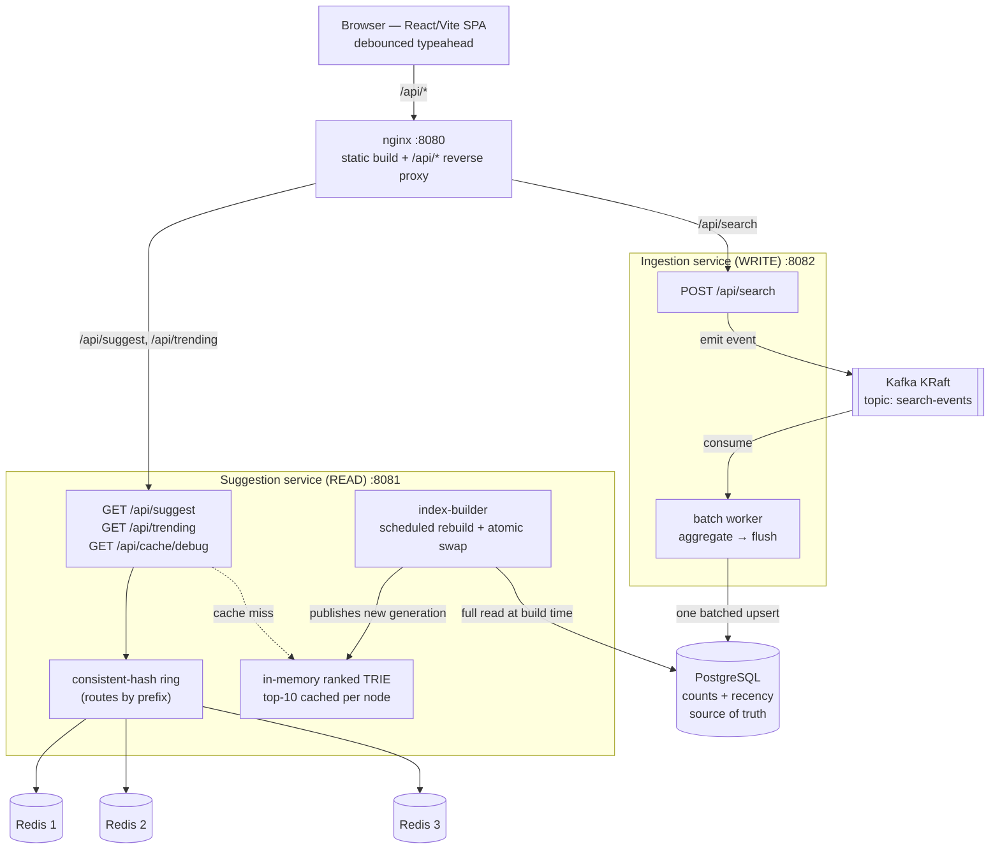

# Search Typeahead — System Report

A search-autocomplete system: low-latency prefix suggestions ranked by popularity and
recency, with every submitted search recorded so rankings stay current. Built as two
Spring Boot (Java 21) services behind nginx, with PostgreSQL as the source of truth, a
three-node Redis cache addressed by a consistent-hash ring, and Kafka (KRaft) as a durable
write-ahead log. Frontend is React + Vite + TypeScript + Tailwind.

> Companion design docs: [`ARCHITECTURE.md`](./ARCHITECTURE.md) (the *what/why*) and
> [`STACK.md`](./STACK.md) (technology choices). This report is the consolidated submission and
> reflects the system **as built and measured**.

---

## 1. Architecture

### Guiding principle

**Decouple the read path from the write path.** Reads (suggestions) are high-volume and
latency-critical. Writes (search submissions) are throughput-oriented and processed lazily.
A third actor — the **index-builder** — periodically converts write-optimized rows into a
read-optimized structure and bridges the two. The serve path **never touches the database
per request**: a cache miss falls back to an in-memory trie, not to Postgres.

### Diagram



### Components

| Component | Role |
| --------- | ---- |
| **Frontend** (React/Vite/TS/Tailwind) | Debounced input, suggestion dropdown, keyboard nav, trending chips, loading/error/empty states. Served as a static build. |
| **nginx** | Single origin (no CORS): serves the static build and reverse-proxies `/api/*` by path. Optional L7 LB seam via `upstream` blocks. |
| **Suggestion service** (read) | Owns the consistent-hash ring **and** the in-memory trie. Cache-first; trie on miss; never writes. Hosts the index-builder. |
| **Ingestion service** (write) | `POST /api/search` → validate, enqueue to Kafka, return immediately. Hosts the batch worker. |
| **In-memory trie** | Read-optimized serving structure; each node caches the top-10 completions of its subtree. O(prefix length) lookups. |
| **Redis ×3** | Distributed cache of per-prefix top-10 lists. Three **standalone** instances (not Redis Cluster) — the service owns routing. |
| **Kafka (KRaft)** | Durable, replayable event log between `POST /search` and the batch worker; the write-ahead log. Single broker, no Zookeeper. |
| **PostgreSQL** | Source of truth (counts + recency). Written by the batch worker; read in full only by the index-builder. |

### Read path — serving suggestions

1. The UI **debounces** keystrokes (140 ms) so there is no request per character.
2. `GET /api/suggest?q=<prefix>` hits the suggestion service.
3. Routing: `hash(prefix) → Redis node` via the consistent-hash ring; the storage key embeds
   the build generation: `suggest:v<gen>:<prefix>`.
4. **Hit** → return the cached top-10 (`X-Cache: HIT`).
5. **Miss** → walk the in-memory trie to the prefix node (microseconds), read its precomputed
   top-10, write it back to the owning Redis node with a jittered TTL, return (`X-Cache: MISS`).

Input handling: missing/blank → `[]` (`X-Cache: BYPASS`); lowercased + trimmed for
case-insensitive matching, matching the write-path normalization; no-match → `[]`, cached
(negative caching).

### Write path — search submission and batching

1. `POST /api/search` validates, produces an event to Kafka topic `search-events`, returns
   `{"message":"Searched"}` immediately. Never touches Postgres directly.
2. The **batch worker** (single consumer thread) accumulates events into an in-memory
   `Map<query, count>`. Duplicates collapse — 500 `iphone` events become one `+500`.
3. **Flush on size OR timer**, whichever comes first (default 1000 distinct / 5 s). The timer
   bounds staleness and crash-loss during quiet periods.
4. On flush: swap the buffer for a fresh empty map, apply **all** deltas in **one batched
   `INSERT … ON CONFLICT DO UPDATE`** transaction (recency decay folded in), **then** commit
   the Kafka offset → **at-least-once** (uncommitted events replay after a crash).

### Index-builder & freshness

The builder is the only thing that propagates batch-written counts into what users see
("rebuild = publish a new version"):

1. Full read of `queries` from Postgres (offline, not per-request).
2. Insert each query into a fresh trie with its blended score baked in.
3. **Post-order DFS:** each node merges its children's top-10 lists plus its own terminal into
   its own top-10 (a genuine merge — one child's 10 best can outrank all siblings).
4. Bump the build **generation** and **atomically swap** the new trie in via an `AtomicReference`
   (reads are lock-free and never see a half-built trie).

Cadence: every 45 s by default (15 s in the local demo). **Staleness budget is additive:**
`flush lag (≤ ~5 s) + rebuild lag (≤ ~45 s)`. Because cache keys are generation-versioned, a
rebuild instantly orphans the old keys (they age out via TTL) and reads re-populate under the
new generation — no deletes, no write-through.

### Consistent-hash ring

A `TreeMap<Long, NodeId>` with ~150 **virtual nodes** per physical Redis node; lookup is
`ceilingEntry(hash(key))` with wraparound; murmur3-128 hashing. This is **sharding the service
owns in-process**, not Redis Cluster. Removing a node remaps only ~1/N of keys. A 5 s liveness
check rebuilds the ring from reachable nodes, and all Redis access is **fail-open** — a dead
node yields a miss served from the trie, never an error.

> **As-built refinement:** the ring routes by the **stable prefix**, not the
> generation-versioned storage key. This keeps a node owning a fixed slice of prefixes across
> the frequent generation bumps, so only membership changes remap keys — making the
> consistent-hashing behavior cleanly demonstrable via `/api/cache/debug`.

### Trending — recency-aware ranking

Each query carries a `recent_score`, decayed lazily by `factor^elapsed` at each batch write
(6 h half-life, no global sweep). Ranking is blended and baked into the trie at build time:
`score = w1·log1p(all_time_count) + w2·recent_score`. **Trending** is the global top-10 — the
trie root's `topK` — served via `GET /api/trending` through the same cache-first path.

### Stampede defenses

| Defense | Prevents |
| ------- | -------- |
| **Single-flight** | Hot-key dogpile: concurrent misses on one key collapse onto one trie load; the rest share its future. |
| **TTL jitter** (`60 s + [0..15 s]`) | Synchronized expiry: spreads expiries so many keys don't go cold on the same tick. |
| **Generation keys** | Rebuild-time miss burst: old keys orphan gracefully and age out instead of being mass-deleted. |

---

## 2. Dataset — source & loading

### Source

**AmazonQAC** — <https://huggingface.co/datasets/amazon/AmazonQAC> (license
**CDLA-Permissive-2.0**). A naturalistic query-autocomplete dataset from U.S. Amazon search
logs (Sept 2023): ~395M rows over **40M unique search terms**, Parquet/Snappy (~59 GB).

| Column | Use |
| ------ | --- |
| `final_search_term` | the query string → `queries.query` |
| `popularity` | **precomputed global occurrence count** → `queries.all_time_count` |
| `search_time` | timestamp (optional; can seed `recent_score`) |

Because `popularity` is a global count, `(query, count)` needs almost no derivation, and
processing a **subset of shards** still yields correct counts for the terms present. The
serving trie is in memory, so we load the **top-N by popularity** (default **1,000,000**;
tunable) rather than all 40M. Only the **train** split carries `popularity` (the test split is
event-level with a different schema), so the train split is the load source.

### Schema (PostgreSQL, via Flyway `V1__queries.sql`)

```sql
CREATE TABLE queries (
    query           TEXT PRIMARY KEY,
    all_time_count  BIGINT           NOT NULL DEFAULT 0,
    recent_score    DOUBLE PRECISION NOT NULL DEFAULT 0,
    last_updated    TIMESTAMPTZ      NOT NULL DEFAULT now()
);
CREATE INDEX idx_queries_query ON queries (query text_pattern_ops);
```

### Loading instructions

**Prereqs:** the compose stack up (`postgres` reachable), one or more AmazonQAC train parquet
shards in `./data/`, and Python with DuckDB (`pip install duckdb`).

```bash
# 1. Bring up infrastructure
docker compose up -d postgres redis-1 redis-2 redis-3 kafka

# 2. Download at least one train shard into ./data (full pull is large; one shard suffices
#    because popularity is a global count)
huggingface-cli download amazon/AmazonQAC --repo-type dataset \
  --include 'train-*.parquet' --local-dir ./data

# 3. Migrate schema + aggregate parquet + load CSV into Postgres (one command)
./loader/load.sh
```

What `loader/load.sh` does (and its knobs):

| Step | Tool | Detail |
| ---- | ---- | ------ |
| Migrate schema | Flyway 10 (container) | applies `db/migration/V1__queries.sql` |
| Aggregate parquet → CSV | DuckDB (`loader/aggregate.py`) | `max(popularity)` once per exact term, then fold `lower(trim(...))` case/whitespace variants, keep top-N by count |
| Load CSV → Postgres | `psql \copy` | `TRUNCATE queries` then stream `(query, all_time_count)` |

Tunables (env): `TOP_N` (default `1000000`), `PARQUET_GLOB` (default `data/train-*.parquet`),
`DUCKDB_MEMORY_LIMIT` (default `4GB`).

**Verify:**

```bash
docker compose exec postgres psql -U app -d typeahead -tAc "SELECT count(*) FROM queries"   # ≈ 1,000,000
docker compose exec postgres psql -U app -d typeahead \
  -c "SELECT query, all_time_count FROM queries ORDER BY all_time_count DESC LIMIT 5"
# → recognizable popular queries (halloween decorations, airpods, apple watch, …)
```

`recent_score` starts at 0 and accrues from live `/api/search` traffic; the index-builder
picks up the loaded rows on its next rebuild.

---

## 3. API documentation

All endpoints are reachable through the nginx edge at `http://localhost:8080` (single origin),
or directly on the service ports during development.

| Method | Path | Service | Purpose |
| ------ | ---- | ------- | ------- |
| `GET` | `/api/suggest?q=<prefix>` | suggestion :8081 | Up to 10 prefix matches, ranked |
| `GET` | `/api/trending` | suggestion :8081 | Global recency-blended top-10 |
| `GET` | `/api/cache/debug?prefix=<p>` | suggestion :8081 | Cache routing introspection |
| `POST` | `/api/search` | ingestion :8082 | Record a submitted search |
| `GET` | `/actuator/prometheus` | both | Micrometer metrics |

### `GET /api/suggest`

Query params: `q` (prefix; missing/blank → `[]`). Response `200`, `application/json`:

```jsonc
// GET /api/suggest?q=iph
[
  { "query": "iphone 15 pro max case", "score": 11.68 },
  { "query": "iphone 15 pro case",     "score": 11.47 }
  // … up to 10, sorted by score desc
]
```

Response header **`X-Cache`**: `HIT` (served from Redis) · `MISS` (served from trie, then
cached) · `BYPASS` (blank query, no work done). Case-insensitive; no-match → `[]`.

```bash
curl -s "http://localhost:8080/api/suggest?q=iph" -D - | grep -i x-cache   # X-Cache: HIT|MISS
```

### `GET /api/trending`

No params. Returns the global top-10 (recency-blended). Same `Suggestion[]` shape and `X-Cache`
header as `/api/suggest`.

```bash
curl -s "http://localhost:8080/api/trending"
```

### `GET /api/cache/debug`

Query param: `prefix`. Reports the owning Redis node and whether the key is currently present.

```jsonc
// GET /api/cache/debug?prefix=iph
{ "prefix": "iph", "generation": 4, "key": "suggest:v4:iph",
  "ownerNode": "redis-1:6379", "status": "HIT" }
```

### `POST /api/search`

Body `application/json`: `{ "query": "<string>" }`. Returns `{"message":"Searched"}` on success
(`200`); blank/invalid body → `400`. The event is enqueued for batched counting — the response
does not wait for the DB write.

```bash
curl -s -XPOST "http://localhost:8080/api/search" \
  -H "Content-Type: application/json" -d '{"query":"airpods pro"}'
# → {"message":"Searched"}
```

---

## 4. Design choices & trade-offs

| Decision | Why | Trade-off accepted |
| -------- | --- | ------------------ |
| **Read/write split into two services** | Serve path is latency-critical and stateless; ingestion is throughput-oriented and stateful. Recompute must never touch read latency. | Two deployables + a queue between them; deliberate fidelity over necessity at this scale. |
| **In-memory trie as the miss path (not Postgres)** | A miss is a microsecond trie walk, not a DB scan; Postgres stays off the per-request path entirely. | The cache hit-vs-miss latency gap shrinks (both are fast) — we trade a flashy cache-win graph for architectural honesty. |
| **Index-builder + atomic swap** | The only thing that propagates batch-written counts into suggestions; rebuild = publish-new-version; lock-free reads. | Rebuild lag (≤ ~45 s) added to the staleness budget. |
| **Consistent-hash ring over 3 standalone Redis** | Partition prefix keys across nodes with ~1/N remap on membership change; sharding owned in app code; legible failure demo. | Not Redis Cluster (we forgo its built-in slot routing to *own* the hashing we must demonstrate). At 100k–1M, Redis is a distribution demo + warm-cache absorber, not a latency win. |
| **Route ring by prefix, not by versioned key** | Keeps node ownership stable across frequent generation bumps, so only membership changes remap. | Minor deviation from the original design sketch (which hashes the full key). |
| **Generation-versioned keys, not write-through** | Redis goes current the instant the trie does, with no per-prefix cross-node fan-out and no write-path/cache coupling. | Briefly stale keys until they age out; orphaned keys consume memory until TTL. |
| **Size-OR-timer, whole-map flush; no per-query gate** | Batching already minimizes writes; the timer bounds staleness; a per-query gate is either anti-batching (eager writes) or lossy (strands the long tail). | None meaningful — one flush is one transaction whether it carries 50 or 5,000 rows. |
| **At-least-once (write-then-commit-offset)** | Kafka is the WAL; uncommitted events replay after a crash, so the in-flight buffer is never the only copy. | Possible small double-count on crash — acceptable because ranking needs only approximate counts. |
| **Lazy `factor^elapsed` decay** | Recency without a global sweep; a brief spike can't rank forever. | Decay is applied only when a row is touched (the builder can decay-to-`now` at read for accuracy). |
| **Single-flight + TTL jitter** | Defend the two distinct stampede shapes (one hot key vs many keys expiring together). | Load-bearing under load testing; with a microsecond miss path they primarily demonstrate the failure mode. |
| **Kafka (KRaft) over a lighter queue** | Fidelity to how large systems ingest query streams: durable, partitioned, replayable; consumer-group offsets give exactly the at-least-once semantics we need. | Heavier than a 100k workload strictly needs; KRaft keeps the cost to a single container. |
| **Fail-open Redis access** | Cache is regenerable; a dead node should degrade to a trie-served miss, never an error (typeahead is best-effort, not critical-path). | A node loss is a self-healing miss spike, not data loss → Redis is intentionally **not** replicated; only Postgres is. |

> **Honest framing.** The microservice split, the Kafka log, and the consistent-hash ring are
> deliberate learning artifacts that demonstrate real architecture; at 1M queries they are not
> strictly necessary. Each is defended on its principle above, not its label.

---

## 5. Performance report

### Methodology

- **Tool:** k6 (`load-test/suggest.js`), 200 VUs — ramp 30 s → hold 2 m → drain 30 s.
- **Traffic shape:** prefixes sampled by **inverse-CDF** from `load-test/prefixes.json` — 300
  length-2/3 prefixes weighted by real query popularity, so a few hot prefixes dominate
  (Zipfian). ~10% of iterations also `POST /api/search`. Each read is tagged by its `X-Cache`
  header so hit rate and per-outcome latency split out.
- **System under test:** full stack, 1M queries loaded, trie holds the top 300k (~2.6M nodes),
  rebuild every 15 s. k6 ran inside the compose network against both the nginx edge (`web:80`,
  routes both paths) and the service directly (`suggestion-service:8081`, isolates the read path).
- **Server-side:** Micrometer `suggest.request` timer tagged `cache=hit|miss` with a percentile
  histogram on `/actuator/prometheus`.

### Latency — `GET /api/suggest`

| Path | hit rate | throughput | p50 | p90 | p95 | p99 |
| ---- | -------- | ---------- | --- | --- | --- | --- |
| **direct to service** | 99.85% | 16,981 req/s | 7.9 ms | 16.1 ms | **20.1 ms** | **37.8 ms** |
| **via nginx edge** | 99.77% | 10,159 req/s | 9.9 ms | 20.4 ms | 25.7 ms | 53.9 ms |

Split by cache outcome (edge): **hit** med 9.9 ms / p95 25.7 ms; **miss** med 13.7 ms /
p95 32.9 ms. Misses stay cheap because they hit the in-memory trie, never the DB.

**Server-side serve time** (Micrometer, pure work, no transport): **hit avg ≈ 3.5 ms**,
**miss avg ≈ 8.5 ms** — so most of the client-side number is transport, not work.

The read path meets the targets (p95 < 25 ms, p99 < 60 ms) measured at the service. An isolated
low-concurrency probe (10 VUs, warm prefixes, direct vs edge) put the **nginx hop at ~0.7 ms
p95** (1.37 → 2.08 ms); the under-load edge spread (25–37 ms run-to-run) is host contention and
the 15 s rebuild miss-bursts, **not** the proxy. (An attempt to shave it with `upstream`
keepalive pools was tested and reverted — it made p95 *worse* under 200 VUs.)

### Cache hit rate

**99.8%** in steady state — the Zipfian ceiling. A few hot prefixes stay warm; single-flight +
TTL jitter keep the miss trickle from dogpiling. Server counters over a run: **4.43M hits vs
7,789 misses vs 6,703 trie loads** — `loads < misses` confirms single-flight collapsing
concurrent cold reads.

### Write reduction — `POST /api/search` → Postgres

Ingestion counters across one edge run:

| Metric | Δ during run |
| ------ | ------------ |
| `ingest.events.received` | 166,699 |
| `ingest.db.upserts` (rows) | 10,746 |
| `ingest.flushes` (DB transactions) | 37 |

**166,699 search events collapsed into 37 batched DB transactions** (~4,500 events per write);
folding duplicate queries within each batch gives 10,746 row upserts — **≈ 15.5 : 1**
event-to-row. DB write rate is governed by flush size/interval, not search QPS — the whole point
of the batch worker.

### Index rebuild

~1.5 s to build the 300k-query trie (~2.6M nodes); swapped atomically every 15 s in the demo.
Each rebuild bumps the generation, orphaning old cache keys (a brief miss blip that single-flight
absorbs).

### Tuning knobs (re-measure against these)

`flush-size` / `flush-interval-ms` (write batching vs staleness) · `base-ttl-seconds` /
`jitter-seconds` (miss smoothing) · `builder.rebuild-interval-ms` (freshness vs build cost) ·
`ring.vnodes` (key-distribution evenness) · `index.max-queries` (trie size vs memory/build time).

> Full results and the reproduce command are in [`load-test/RESULTS.md`](./load-test/RESULTS.md).

---

## Appendix — running it

```bash
docker compose up -d                 # postgres, redis ×3, kafka, both services, nginx web
./loader/load.sh                     # one-time dataset load (see §2)
# open http://localhost:8080
```

| Service | Host port | Notes |
| ------- | --------- | ----- |
| web (nginx) | **8080** | the app + `/api/*` proxy — start here |
| suggestion-service | 8081 | read path |
| ingestion-service | 8082 | write path |
| postgres | 5432 | source of truth |
| redis-1/2/3 | 16379 / 16380 / 16381 | cache ring (container port stays 6379) |
| kafka | 9094 | external listener (`search-events`) |

**Reproduce the load test:**

```bash
docker run --rm --network typeahead_default -v "$PWD/load-test:/scripts" \
  -e BASE_URL=http://web:80 grafana/k6 run /scripts/suggest.js
```
